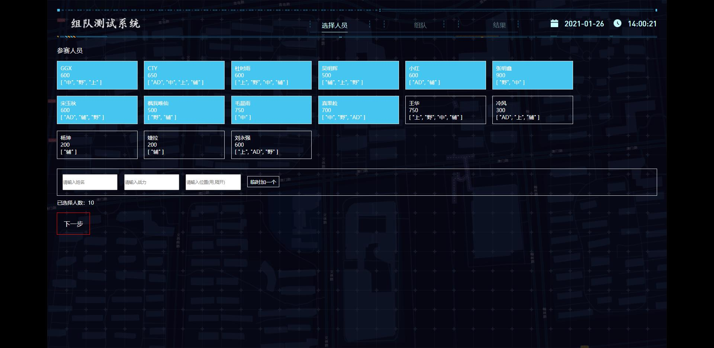
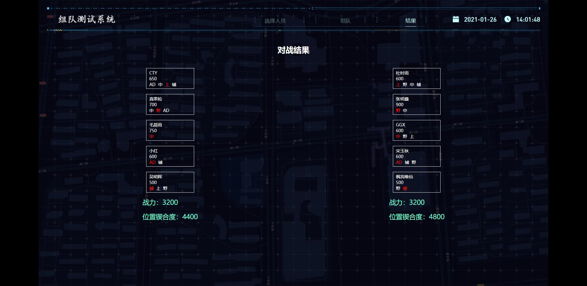

# lol-zudui

## 简介
组队系统

## 服务端

serverl 是node 写的一个小服务，主要用来存 组队结果，和查看组队结果

## 发布
现在都发 157上，然后映射它
157
scp -r serverl root@172.16.200.157:/data/casair_nginx/html

scp -r public/json root@172.16.200.157:/data/casair_nginx/html/lol-zudui

163
scp -P 2201 -r serverl root@117.132.4.163:/data/casair_nginx/html

130
scp -P 22 -r serverl root@117.132.2.130:/casair_nginx/html

scp -P 22 -r public/json root@117.132.2.130:/casair_nginx/html/lol-zudui

## 地址

### 157测试
[发布者](http://172.16.200.157:22020/lol-zudui/?type=0#/)
[参与者](http://172.16.200.157:22020/lol-zudui/#/)

### 157映射域名
[发布者](http://zd-test.cas-air.cn/?type=0#/)
[参与者](http://zd-test.cas-air.cn/)

### 163环境 不好使
[发布者](http://117.132.4.163:22020/lol-zudui/?type=0#/)
[参与者](http://117.132.4.163:22020/lol-zudui/#/)

### 130 环境

[发布者](http://117.132.2.130:22020/lol-zudui/?type=0#/)
[参与者](http://117.132.2.130:22020/lol-zudui/#/)

## 预览

